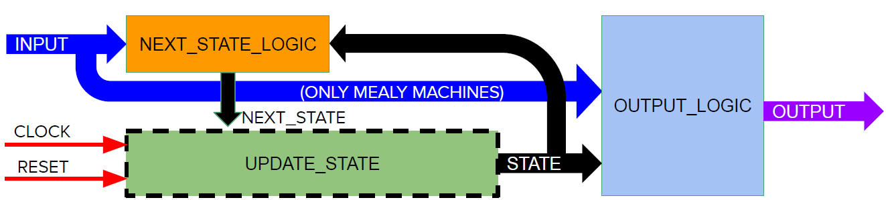

   

# Arbiter Game

## Description

This is an implementation of a simple 2 players game based on the educational example [arbiter](https://gitlab.com/educiaafpga/ejemplos/-/tree/master/Ejemplos_Base/14-Arbiter) from the [EDU-CIAA-FPGA](https://gitlab.com/educiaafpga/ejemplos/-/blob/master/PROYECTO_EDU_CIAA_FPGA.md) public repository. 

The purpose of the game is to introduce students to sequential logic by implementing common digital blocks like counters, registers, shift registers and finite state machines:

## Block diagram

## Game description

This is a 2 players game, where every player has an active low pushbutton assigned (**req1_in** and **req2_in** inputs to top level). After applying reset to the circuit, a countdown will be displayed at the output ports (ideally connected to some LEDs). Then, when the last LED stops toggling, the players will press the buttons. The first player to press the button wins and this will be displayed in output LEDs:

>Player 1 wins

>Player 2 wins

## More about EDU-CIAA-FPGA project:

The **EDU-CIAA-FPGA** project is an open source initiative that encompases:

- Open hardware
- Open toolchain
- An active community providing support with examples and educational resources.

For more information about the project visit:

- [Youtube Channel](https://www.youtube.com/@educiaafpga3040)
- [Open hardware repository](https://github.com/ciaa/Hardware/tree/master/PCB/EDU-FPGA)
- [Tools repository](https://gitlab.com/educiaafpga/herramientas)
- [Examples repository](https://gitlab.com/educiaafpga/ejemplos)
- [Wiki](https://gitlab.com/RamadrianG/wiki---fpga-para-todos)

# What is Tiny Tapeout?

TinyTapeout is an educational project that aims to make it easier and cheaper than ever to get your digital designs manufactured on a real chip!

Go to https://tinytapeout.com for instructions!

## How to change the Wokwi project

Edit the [info.yaml](info.yaml) and change the wokwi_id to match your project.

## How to enable the GitHub actions to build the ASIC files

Please see the instructions for:

* [Enabling GitHub Actions](https://tinytapeout.com/faq/#when-i-commit-my-change-the-gds-action-isnt-running)
* [Enabling GitHub Pages](https://tinytapeout.com/faq/#my-github-action-is-failing-on-the-pages-part)

## How does it work?

When you edit the info.yaml to choose a different ID, the [GitHub Action](.github/workflows/gds.yaml) will fetch the digital netlist of your design from Wokwi.

After that, the action uses the open source ASIC tool called [OpenLane](https://www.zerotoasiccourse.com/terminology/openlane/) to build the files needed to fabricate an ASIC.

## Resources

* [FAQ](https://tinytapeout.com/faq/)
* [Digital design lessons](https://tinytapeout.com/digital_design/)
* [Learn how semiconductors work](https://tinytapeout.com/siliwiz/)
* [Join the community](https://discord.gg/rPK2nSjxy8)

## What next?

* Share your GDS on Twitter, tag it [#tinytapeout](https://twitter.com/hashtag/tinytapeout?src=hashtag_click) and [link me](https://twitter.com/matthewvenn)!
